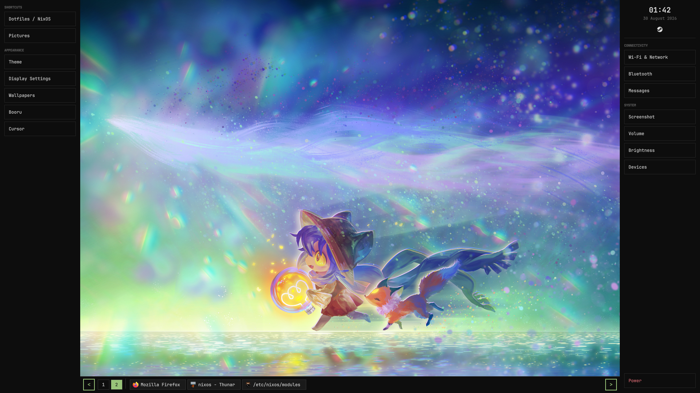

# nexoniarz-config-nixos

My personal NixOS system configuration and dotfiles tailored for my daily usage and needs.

## Overview

- **OS:** NixOS
- **WM / Compositor:** Hyprland (Wayland)
- **Bar / Panels:** Quickshell
- **Terminal:** Kitty
- **Shell:** Zsh

---

*Made by **Nexoniarz***
